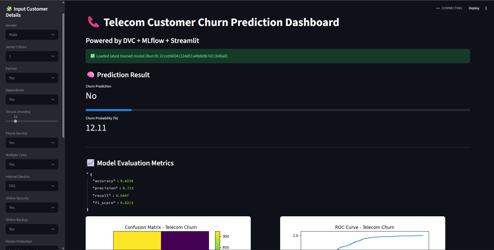

# 📞 Telecom Customer Churn Prediction (MLflow + DVC + Streamlit)

A **production-grade Machine Learning pipeline** for predicting telecom customer churn, fully automated with **DVC**, tracked via **MLflow**, and deployed with an interactive **Streamlit dashboard**.

---

## 🚀 Features
✅ End-to-end ML pipeline using DVC  
✅ MLflow integration for experiment tracking  
✅ Model versioning with metrics and graphs  
✅ Streamlit dashboard for live predictions  
✅ Confusion matrix & ROC curve visualization  
✅ Automatic data versioning and logging  

---
Streamlit link : https://customerchurnmlpipelinedvcmlflow-jqzis8eacgadsmsmczq4bm.streamlit.app/

📦 Note on DVC and Artifacts

This project was originally developed with a complete DVC (Data Version Control) pipeline for end-to-end automation — including data ingestion, preprocessing, feature engineering, model training, and evaluation stages.
However, since Streamlit Cloud cannot access local DVC storage or MLflow’s mlruns folder directly, the final trained model and essential artifacts (model.pkl, ohe.pkl, scaler.pkl, confusion_matrix.png, roc_curve.png) were manually added to the repository.

This ensures that:

The Streamlit app runs seamlessly online using these committed files.

Viewers can still explore the complete MLOps pipeline structure (dvc.yaml, params.yaml, and src/ scripts).

The repository remains fully reproducible — you can re-run the DVC pipeline locally to regenerate all files.

In short:

🧠 DVC manages the pipeline → MLflow tracks experiments → Streamlit deploys the final model → GitHub stores the final artifacts for public access.

sha256:a3489988a695a540a740314cbb6cf3bf0093298645cfecb67bd6a4ed8f9239a1

docker run -d -p 80:8501 your-image
docker run -d -p 80:8501 your-image   
docker pull chandu013/churn_app:latest
docker tag churn_app chandu013/churn_app:latest

docker build -t churn_app .
