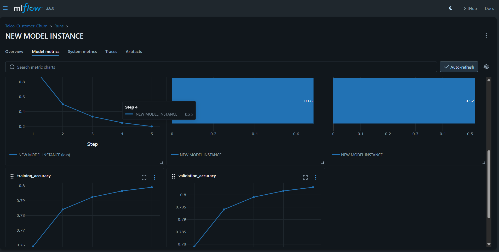

# 📞 Telecom Customer Churn Prediction  
### End-to-End MLOps Project using DVC, MLflow, Streamlit & Docker

This project is a **production-grade Machine Learning system** that predicts **telecom customer churn** using a fully reproducible **ML pipeline** built with **DVC**, tracked using **MLflow**, and deployed as an interactive **Streamlit web application**.

It demonstrates **real-world MLOps practices** such as data versioning, pipeline automation, experiment tracking, and model deployment.

---

## 🚀 Key Features

✅ End-to-end ML pipeline using **DVC**  
✅ Experiment tracking and comparison using **MLflow**  
✅ Model versioning with metrics and visualizations  
✅ Interactive **Streamlit dashboard** for live predictions  
✅ Confusion matrix & ROC curve visualization  
✅ Dockerized application for easy deployment  
✅ Fully reproducible pipeline (local execution)

---

## 🌐 Live Demo

🔗 **Streamlit Application:**  
https://customerchurnmlpipelinedvcmlflow-jqzis8eacgadsmsmczq4bm.streamlit.app/

---

## 📊 Screenshots

### MLflow Experiment Tracking

---

## 🧠 Problem Statement

Customer churn is a major challenge in the telecom industry.  
The goal of this project is to **predict whether a customer is likely to churn** based on historical customer data, enabling businesses to take proactive retention measures.

---
## ⚙️ Tech Stack

- **Python**
- **Scikit-learn**
- **Pandas, NumPy**
- **DVC (Data Version Control)**
- **MLflow**
- **Streamlit**
- **Docker**
- **Git & GitHub**

---

## 📦 Important Note on DVC, MLflow & Artifacts

This project was **originally developed as a fully automated DVC pipeline**, covering:

- Data ingestion  
- Data preprocessing & feature engineering  
- Model training  
- Model evaluation  

### 🔹 Role of Tools
- **DVC** → Manages datasets, pipeline stages, and reproducibility  
- **MLflow** → Tracks experiments, parameters, metrics, and model versions  

> **In short:**  
> 🧠 DVC manages the pipeline → 📊 MLflow tracks experiments → 🌐 Streamlit deploys the model → 🗂️ GitHub hosts final artifacts

---
Dinesh |
